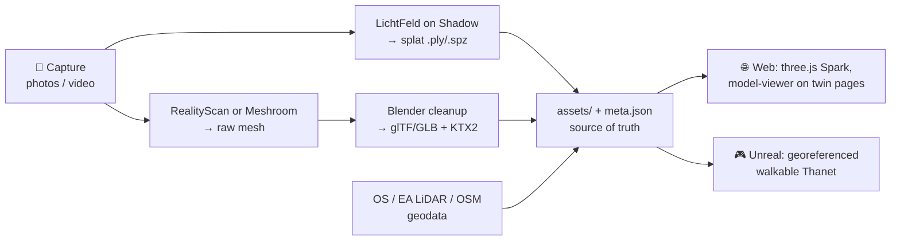

# 3D Thanet

A living 3D environment of Thanet, UK — Margate, Ramsgate, Broadstairs and the
villages between — built from real captures of real places, grounded in real
geography, and serving the public.charity digital twin: every scanned café,
church hall, food bank and seafront gets a 3D presence that outlives whoever
captured it.

**The one rule that keeps this show on the road: assets are engine-independent.
Engines are consumers.** The source of truth is this folder — glTF meshes,
Gaussian splats, geodata, Blender sources. The web renders them today. Unreal
renders them next. Neither ever *owns* them.

---

## The stack we have

| Piece | Role |
|---|---|
| Phone (photos/video) | Capture. The scanner we always have with us |
| Shadow Power VM (RTX A4500, 20 GB VRAM) | Heavy lifting: LichtFeld Studio splat training, Unreal Engine |
| LichtFeld Studio | Photos/video → Gaussian splats (`.ply` → `.spz`) |
| Blender (free, scriptable) | Mesh cleanup, decimation, glTF export — the pipeline's workbench |
| RealityScan / Meshroom | Photogrammetry when we need a *mesh* (measurable, editable), not a splat |
| public.charity platform (Next.js/Prisma/Fly) | The web consumer: embeds viewers on twin pages |
| three.js + Spark / `<model-viewer>` | Browser rendering of splats and glTF |
| **Unreal Engine** (installing now) | The immersive consumer: walkable, cinematic Thanet |
| Free UK geodata (OS Terrain 50, Environment Agency LiDAR, OSM) | The ground everything sits on |

## Folder layout

```
thanet-3d/
├── assets/            ← engine-independent source of truth
│   ├── captures/      raw photos & video per site (huge; LFS/external, never required to build)
│   ├── splats/        Gaussian splats: shipping .spz + archival .ply
│   ├── models/        glTF/GLB (delivery) + .blend (source)
│   ├── textures/      source textures + compressed KTX2
│   ├── geo/           terrain, building footprints, boundaries — real-world data
│   └── hdri/          skies (Thanet has famous ones; capture our own eventually)
├── pipeline/          scripts that turn captures into assets (Blender python, converters)
└── unreal/            the Unreal project — a THIN consumer (see rules below)
```

Every asset gets a JSON sidecar (`<name>.meta.json`, template in `assets/`)
recording **where it is on Earth** (lat/lon), when and how it was captured, and
its licence. An asset without coordinates can't take its place in Thanet;
metadata is not optional.

## The pipeline



1. **Capture** — slow orbit video or overlapping photos, diffuse light (Thanet
   overcast is *good*), lock exposure, get high/mid/low passes. Ten minutes on
   site beats an hour of fixing later.
2. **Process on the Shadow box** — LichtFeld for splats (default for places:
   best realism-per-effort); photogrammetry → Blender for objects that need to
   be real meshes.
3. **Land in `assets/` with one command** — take the `.ply` LichtFeld saved and run:

   ```sh
   pipeline/add-splat.sh margate-harbour-arm ~/Downloads/export.ply
   ```

   That archives the master, makes the compressed web file, writes a
   double-clickable browser preview, and creates the sidecar. You only add
   lat/lon and a name. (Formats, in one breath: a splat is millions of
   coloured blobs; **`.ply`** is the raw master LichtFeld saves, like a camera
   RAW; **`.spz`** is the same scene ~10× smaller, the JPEG we actually ship.
   The script handles both — you never touch either by hand.)
4. **Consume** — the platform embeds a viewer on the twin's page; Unreal
   imports the same files.

## The Unreal migration (pragmatic order)

Unreal joins as a consumer, in this order — each step useful on its own:

1. **Ground first.** Cesium for Unreal plugin, georeferenced origin on Margate
   seafront (**51.3813 N, 1.3862 E**). Pull OS Terrain 50 / EA LiDAR 1 m DTM
   for the district, OSM building footprints as grey massing. Result: a
   correct, boring 3D Thanet in days, not months.
2. **Drop in the scans.** glTF imports natively (Interchange). Splats need a
   plugin (Luma AI's UE plugin or a current 3DGS plugin — verify against the
   installed UE version). Each asset places itself from its `meta.json`
   coordinates.
3. **Only then make it pretty.** Lighting, water, sky, Nanite settings,
   ambience. Filler content from Fab/Quixel — never hand-model what we can
   scan or download.

### Rules for the `unreal/` folder

- `Binaries/`, `Intermediate/`, `DerivedDataCache/`, `Saved/` are gitignored —
  the project must rebuild from `assets/` + config.
- **No asset is authored inside Unreal** that belongs in `assets/`. If it
  can't be re-imported from the source folder, it's a liability.
- Engine-version pin lives in the `.uproject`; upgrade deliberately, alone, in
  its own commit.

## Keeping the show on the road

- **Vertical slice first**: one street — Margate Harbour Arm to the Turner
  Contemporary. Captured, processed, on the web, walkable in Unreal. Every
  pipeline problem surfaces on 200 m of seafront far cheaper than on a district.
- **Web never waits for Unreal.** A splat on a twin's page ships the day it's
  processed. Unreal is the second consumer, always.
- **Scan, don't model.** Hand-modelling is the tar pit. Real places get
  scanned; filler comes from geodata and asset libraries; only stitching is
  bespoke.
- **Big files stay out of plain git**: `captures/` lives on external storage
  or LFS; committed assets are the compressed delivery files (`.spz`, `.glb`,
  `.ktx2`), each with its sidecar.
- **Every capture session same-day processed** — or the backlog becomes the
  project.
- **The A4500 is the budget.** 20 GB VRAM trains one large splat at a time;
  scenes that fit are scenes that ship. Split big sites into chunks along
  natural seams (per building, per pier section).

## Milestones

- [ ] Repo initialised, LFS configured, first capture committed
- [ ] **Slice 1:** Harbour Arm splat live on a public.charity twin page
- [ ] Unreal + Cesium georeferenced Thanet terrain with OSM massing
- [ ] Same splat/mesh placed in Unreal at true coordinates
- [ ] Pipeline scripted end-to-end (`pipeline/` — one command per stage)
- [ ] Ten Thanet places captured and live
- [ ] First walkable Unreal build shared

---

*Part of the public.charity project (P-2026-001) — free, open, given away.
Assets are CC-BY-4.0 unless a sidecar says otherwise; code is Apache-2.0.*
